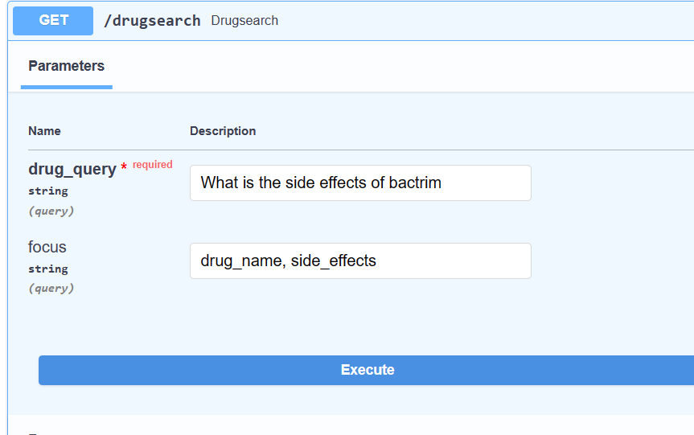

# Drug Side Effect Information Retrival System

This api provides a drug search system which returns the side effects and some other drug informations.

Head over to https://sideeffectir.azurewebsites.net/docs to use the api interactively from the browser.



To use the API from an api client like postman:
- API-  https://sideeffectir.azurewebsites.net/api/drugsearch
- Method - POST
- Paylod
```json
{
  "drug_query": "What are the side effects of bactrim ?",
  "focus": "side_effects, drug_classes"
}
```
**drug_query**, should include the drug name being search for the get the information on the drug.

**focus** include target information's to display for the drug. this should be inputed as a string value and seperated by a comma.


```python
possible focus values
['drug_name', 'medical_condition', 'side_effects', 'generic_name',
       'drug_classes', 'brand_names', 'activity', 'rx_otc',
       'pregnancy_category', 'csa', 'alcohol', 'related_drugs',
       'medical_condition_description', 'rating']
```
**Their Datatypes**
```python
    drug_name: str
    side_effects: list[str]
    generic_name: str 
    drug_classes: list[str]
    brand_names: list[str] 
    activity: str 
    rx_otc: str
    pregnancy_category: str
    csa: str
    alcohol: str
    medical_condition: str 
    related_drugs: list[str]
    rating: Float
    medical_condition_description: str
```
The **DATASET** is available in **clean_drug.master.parquet.**

### Notebooks
**Cleaning_and_processing.ipynb**

This notebook contains the methods applied to clean and preprocessing the data for training.

**Build_model.ipynb**

This notebook contains the methods use to build a rule based NER model.


### NOTE
The api server and deployment platform is limited to 60 mins CPU usage/day.
